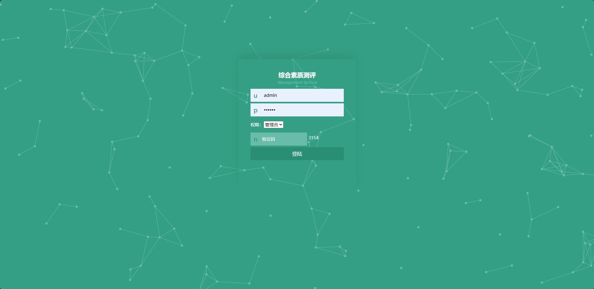

<h1 align="center">基于SSM框架的学生综合素质测评管理系统</h1>

<h4> 完整代码获取地址：从戎源码网（https://armycodes.com/） </h4>
<h4> 作者微信：19941326836 QQ：605739993 QQ群：655392706 </h4>
<h4> 承接计算机毕设、Java毕业设计、Python毕业设计、深度学习、机器学习 </h4>
<h4> 选题+开题报告+任务书+程序定制+安装调试+论文+答辩ppt 一条龙服务 </h4>
<h4> 毕业设计所有选题地址：(https://github.com/Descartes007/allProject) </h4>

## 一、项目介绍

基于SSM框架的学生综合素质测评管理系统：前端 jsp、ajax，后端 springmvc、spring、mybatis；角色分为管理员、教师和学生；管理员管理后台学生和教师信息，对学生成绩进行管理，对综合评测进行管理等；教师对奖惩信息进行管理，对留言内容进行回复等；学生添加奖惩信息，对自己能力加分进行性管理等。主要功能如下：

### 1、管理员：

- 基本操作：登录、修改密码、获取个人信息、上传图片
- 管理员管理：添加管理员、删除管理员、获取管理员列表、获取管理员详情、修改管理员信息
- 学生管理：添加学生信息、获取学生信息列表、查看学生信息详情、修改学生信息、删除学生信息、筛选学生信息
- 教师管理：添加教师信息、获取教师信息列表、查看教师信息详情、修改教师信息、删除教师信息、筛选教师信息
- 学生成绩管理：添加学生成绩信息、获取学生成绩列表、查看学生成绩详情、修改学生成绩信息、删除学生成绩信息
- 综合评测管理：添加综合评测信息、获取综合评测列表、查看综合评测信息详情、修改综合评测信息、删除综合评测信息、筛选综合评测信息

### 2、教师：

- 基本操作：登录、修改密码、获取个人信息、修改个人信息、上传图片
- 奖惩管理：获取奖惩列表、查看奖惩信息详情、修改奖惩信息、删除奖惩信息、筛选奖惩信息
- 留言板管理：获取留言板列表、查看留言板详情、回复留言、筛选留言
- 能力加分管理：添加能力加分信息、获取能力加分列表、查看能力加分信息详情、修改能力加分信息、删除能力加分信息、筛选能力加分信息
- 综合评测管理：获取综合评测列表、筛选综合评测

### 3、学生：

- 基本操作：登录、修改密码、获取个人信息、修改个人信息、上传图片
- 奖惩管理：获取奖惩列表、查看奖惩信息详情、修改奖惩信息、删除奖惩信息、筛选奖惩信息、添加奖惩信息
- 学生成绩管理：获取成绩列表、查看成绩详情、筛选成绩信息、编辑成绩信息、删除成绩信息
- 能力加分管理：获取能力加分列表、查看能力加分详情、筛选能力加分信息、编辑能力加分信息、删除能力加分信息
- 留言板管理：获取留言板列表、查看留言板详情、回复留言、筛选留言、发布留言、编辑留言、删除留言
- 能力加分管理：添加能力加分信息、获取能力加分列表、查看能力加分信息详情、修改能力加分信息、删除能力加分信息、筛选能力加分信息
- 综合评测管理：获取综合评测列表、筛选综合评测、编辑综合评测、查看综合评测详情、删除综合评测

## 二、环境

- <b>IntelliJ IDEA 2020.3</b>

- <b>Mysql 5.7.26</b>

- <b>Tomcat 9.0.60</b>

- <b>JDK 1.8</b>

## 三、运行截图

